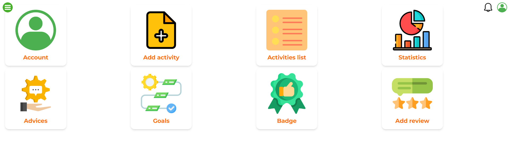
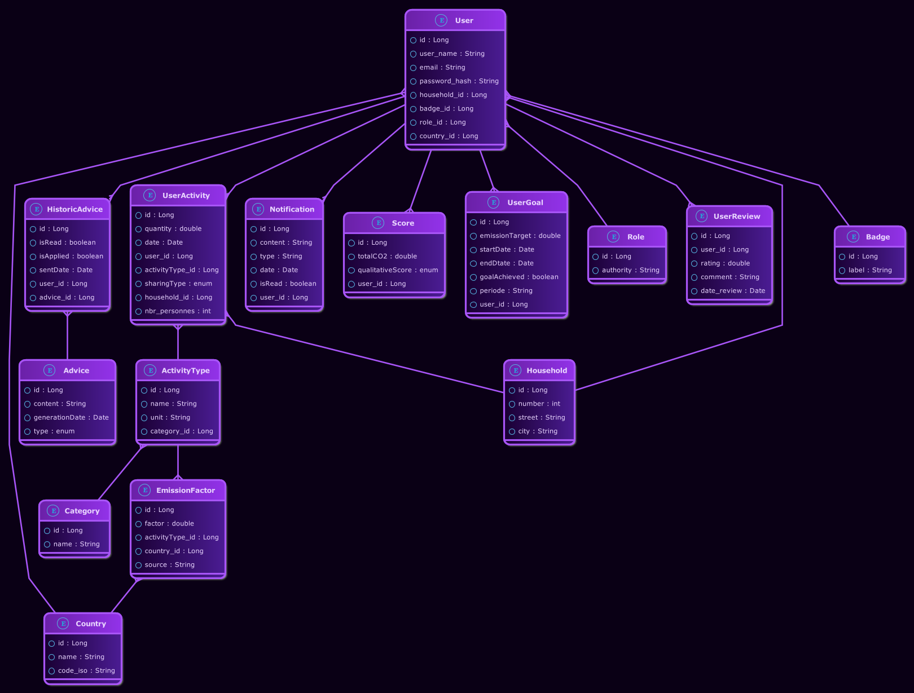

# 🌍 EcoTrack

**EcoTrack** is a smart web application designed to help users monitor and reduce their daily carbon footprint.  
Built with 💚 love for the planet.

---

##  Overview

EcoTrack encourages users to adopt eco-friendly habits through personalized tracking, gamified progress, and insightful statistics.  
It’s an all-in-one platform to **measure, improve, and celebrate** sustainable living 🌱

---

##  Features

| 🌿 Main Features | Description                                 |
|------------------|---------------------------------------------|
| 👤 **Account** | Access your personal profile                |
| ➕ **Add Activity** | Log eco-friendly activities to track your daily progress |
| 🗒️ **Activities List** | View and manage all recorded activities     |
| 📊 **Statistics** | Visualize your environmental impact through dynamic charts |
| 💬 **Advices** | Get personalized tips for greener habits    |
| 🎯 **Goals** | Set and follow sustainability goals         |
| 🏅 **Badge** | Earn badges as you achieve your milestones  |
| ⭐ **Add Review** | Share your feedback and experience          |

<p align="center">
  
</p>

---

##  Database Design

<p align="center">
 
</p>

---

##  Technologies Used

- **Front-end:** HTML, CSS, JavaScript
- **Back-end:** Spring Boot
- **Containerization:** Docker & Docker Compose
- **Database:** PostgreSQL

---

##  Getting Started

###  Setup and Run EcoTrack

```bash
# 1️ Clone the repository
git clone https://github.com/YasmineKoulam/EcoTrack.git
cd EcoTrack

# 2️ Build and run the app using Docker Compose
docker-compose up --build

# 3️ Access the app from your browser
# Par défaut :
#  http://localhost:8080
# (le port est défini dans docker-compose.yml)


